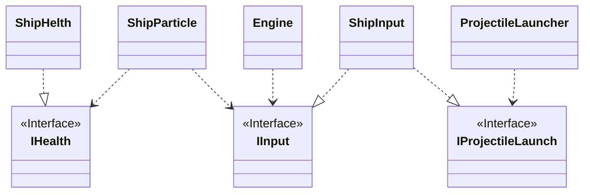
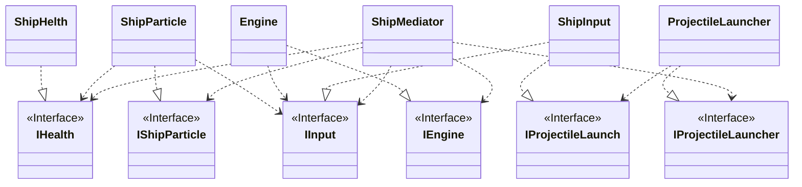

## このリポジトリについて

このリポジトリは、SOLID原則の1つ`単一責任の原則(SingleResponsibilityPrinciple)`について、Unityで実践するためにはどのように実装するのかを例にあげて解説しています。

## リファクタリングする前の`Ship.cs`について

このスクリプトをゲームオブジェクトにアタッチすれば、Shipは想定通りの動きをします。

しかし、このコード(クラス)には問題点があります。

それは、Shipに関するすべての責任を`Shipクラス`が持っていることにあります。

- ステータス(HP)
- 位置、角度の更新
- 入力
- 発射物の管理
- パーティクルの管理

これらの5つの責任を１つのクラスが負担することは、`単一責任の原則`の`1つのクラスは、１つの責任のみを持つ`に反していると判断することができます。

## 責任の分離

Shipクラスが持っている5つの責任をクラスに分離していきます。

- ステータス(HP) : `ShipHealthクラス`
- 位置、角度の更新 : `Engineクラス`
- 入力 : `ShipInputクラス`
- 発射物の管理 : `ProjectileLauncherクラス`
- パーティクルの管理 : `ShipParticleクラス`

## クラス間の依存関係への対応

責任を分離した場合、クラス間の依存関係が必ず発生するので、いくつかクラス間をつなぐ方法があると思います。

### このリポジトリで実装されている方法

Unityらしく同じオブジェクトにスクリプトがアタッチされていることを想定して、`GetComponect`と`RequireComponent`を使用してスクリプト間をつないでいます。

ある程度、クラス間の依存関係を持たせないために、`依存関係逆転の法則`を使うために、インターフェイスを通してつないでいます。

上に書いてあるクラスは直接の依存関係になっていないので、クラス間は疎結合になっているといえると思います。

- 破線ちっこい矢印 : 依存
- 破線でっかい矢印 : インターフェイスの実装

### もう一つの方法

`Mediator(仲介役)クラスを実装`して、その中で各クラスのやり取りを仲介する方法もあります。

この方法では、ShipMediatorクラスを新たに作成し、そのクラスにほかのすべてのクラスの連携を行わせることになります。

`GetComponect`を使用せずに、`ShipMediatorクラス内で紐づけを行います。`

しかし、今のインターフェイスの実装では、値の設定のためのインターフェイスが定義できていないので、クラスに対する依存が強くなってしまいます。

これを解決するためには、既存のインターフェイスに値の設定用のインターフェイスを追加し、必要であれば新しいインターフェイスを作成することで、解決することができるようになります。

私はこちらのほうが好きです。

